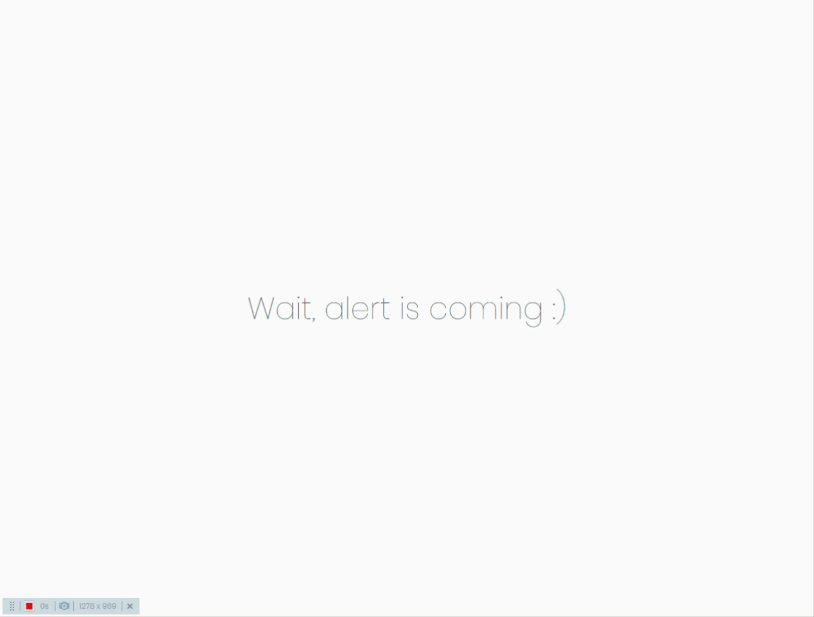

# Basic Alert

Kullanımı oldukça kolay bir o kadar da basit uyarılar için kullanabilirsiniz.

## Kullanım

Css dosyamızı ve javascript dosyamızı sayfaya dahil ettikten sonra;
Önce sınıfımızı çağırıyoruz

    const  alert  =  new  Alert();

Sonra uyarı baloncuğumuz oluşturuyoruz.

    alert.create({
    message: 'www.google.com adresine git.',
    type: 'info',
    duration: 4000,
    position: {
      top: '40px',
      left: '50px',
    },
    click: () => {
      window.location.href = 'http://www.google.com';
    },

});

create methodu artık parametre olarak obje alıyor. Bu obje ile mesaj içeriği, uyarı tipi, ekranda kalma süresi, pozisyon ve tıklanma olayını içeriyor.

